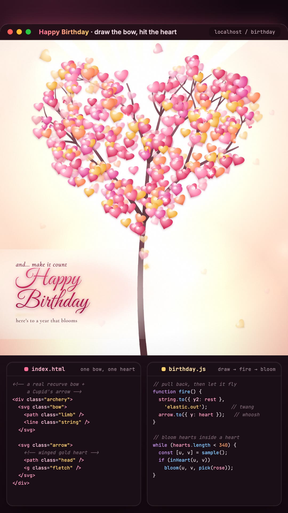

# Happy Birthday ♥

**A little film, made for one person.**

Not a card you scroll past — a card you *do* something with. You draw a bow, you release an arrow, and the page answers you.

<br>

<p align="center">
  <a href="https://skordeanz.github.io/happy-birthday-tree/">
    
  </a>
</p>

<p align="center">
  <b><a href="https://skordeanz.github.io/happy-birthday-tree/">→ Open it here</a></b><br>
  <sub>Best with sound on and a minute to spare. Works on a phone.</sub>
</p>

<br>

---

## What happens

It plays in four acts. You only have to do one thing.

<table>
<tr><td width="70"><b>I</b></td><td>
A single heart beats in a warm field. A recurve bow sits in the corner, string drawn back, a golden Cupid's arrow nocked and waiting.<br>
<b>Your move:</b> drag the string down and let go. Or tap. Or press <kbd>Enter</kbd>.
</td></tr>
<tr><td><b>II</b></td><td>
The arrow flies. It strikes. The heart jolts, falls — and bursts into a flood of rose that swallows the whole frame. No fade, no cross-dissolve. The colour simply <i>arrives</i>.
</td></tr>
<tr><td><b>III</b></td><td>
Inside that colour, a wish hinges up out of nothing, one glyph at a time, under cinema bars and a slow camera push.
</td></tr>
<tr><td><b>IV</b></td><td>
A gold light blooms. A tree grows — and every leaf on it is a heart, hundreds of them, lit from within. It settles, sways, and stays. It does not loop. It just lives there.
</td></tr>
</table>

There's an **Again** button at the end, because one watch is never enough.

---

## Run it yourself

It's a plain [Vite](https://vitejs.dev) site. Nothing exotic.

```bash
git clone https://github.com/skordeanz/happy-birthday-tree.git
cd happy-birthday-tree
npm install
npm run dev
```

Open the URL it prints — usually <http://localhost:5173>.

<details>
<summary>Other commands</summary>

```bash
npm run build     # bundle into dist/
npm run preview   # serve the production build locally
```

If you fork this under a different repo name, change `base` in `vite.config.js` to match (`'/your-repo-name/'`). Skip that and the page loads blank on GitHub Pages — the assets will be looking for the wrong path.
</details>

---

## Make it yours

This was built to be handed over, not admired from a distance. The words are all in one place.

**The text** lives in `index.html` — search for these and change what they say:

| What it says now | Where |
|---|---|
| `a little something, for you` | the eyebrow at the top |
| `pull & release` | the instruction under the bow |
| `make a wish…` | Act III, above the headline |
| `to someone worth celebrating` | Act III, under the headline |
| `Happy Birthday` | the big hand-lettered wish |
| `here's to a year that blooms` | the line beneath it |

**The colours** are CSS variables at the top of `birthday.css` — the rose flood, the gold bloom, the warm field behind the heart. Change a hex and the whole film shifts with it.

**The tree** is generated, not drawn. Act IV picks a few hundred points inside a heart-shaped region and grows a blossom at each one — so it's a little different every single time the page loads. It will never look exactly like this twice.

---

## How it's built

Deliberately small. Three files, no framework, no build step you have to think about.

```
index.html      226 lines   the whole film, as markup + SVG
birthday.css    467 lines   the look, plus the reduced-motion fallback
birthday.js     933 lines   the direction: one GSAP timeline + one canvas
```

- **[GSAP 3](https://gsap.com)** runs the choreography — a single master timeline carries the shot and Acts II–III. A small custom plugin (`drawn`) animates the hand-drawn underline with `stroke-dashoffset`.
- **Canvas 2D** owns Act IV. Once the timeline hands off, the tree takes over its own `requestAnimationFrame` loop and draws its own sky, branches, blossoms, drifting petals and settling orbs. It plays once, then holds.
- **One canvas, one timeline.** No React, no Three.js, no physics engine — the weight of the thing comes from easing curves and colour, not dependencies.
- **Fonts:** Great Vibes (the hand-lettered wish), Cormorant Garamond (the quiet serif), Fraunces (the headline).

Two dependencies total. That's the whole stack.

---

## Accessibility

- The bow is a real focusable control — <kbd>Enter</kbd> or <kbd>Space</kbd> fires it, so the whole film is reachable without a pointer.
- `prefers-reduced-motion` is honoured: the motion collapses to a calm static composition rather than a stripped-out page.
- The canvas carries a text alternative, and a screen-reader-only line states the wish in plain words.

---

## Credit

Made by [@skordeanz](https://github.com/skordeanz).

Written for someone specific — but if you found this and want to send it to someone of your own, please do. That's rather the point. Change the words, change the colours, put your own name on it.

MIT licensed. Take it.
